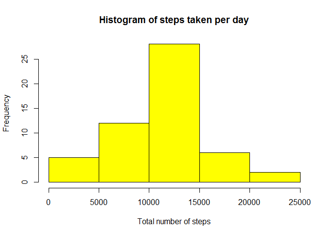
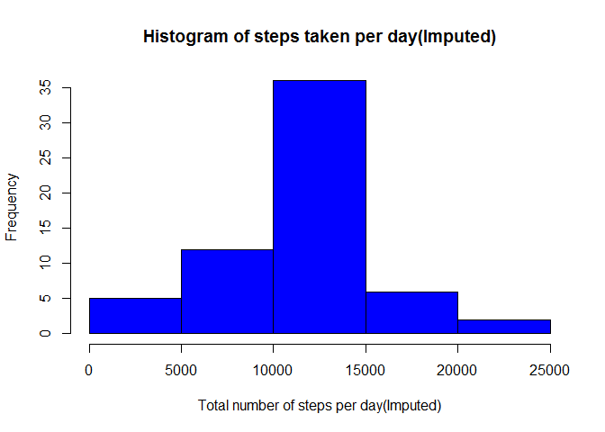
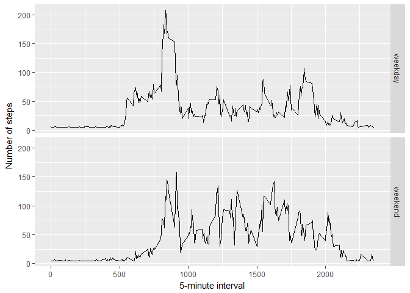

# PA1_template.RMD
Amarendra  
July 8, 2017  
## Initial set up

```r
library(knitr)
knitr::opts_chunk$set(echo = TRUE)
library(dplyr)
```

```
## 
## Attaching package: 'dplyr'
```

```
## The following objects are masked from 'package:stats':
## 
##     filter, lag
```

```
## The following objects are masked from 'package:base':
## 
##     intersect, setdiff, setequal, union
```

```r
library(lubridate)
```

```
## 
## Attaching package: 'lubridate'
```

```
## The following object is masked from 'package:base':
## 
##     date
```

```r
library(Hmisc)
```

```
## Loading required package: lattice
```

```
## Loading required package: survival
```

```
## Loading required package: Formula
```

```
## Loading required package: ggplot2
```

```
## 
## Attaching package: 'Hmisc'
```

```
## The following objects are masked from 'package:dplyr':
## 
##     combine, src, summarize
```

```
## The following objects are masked from 'package:base':
## 
##     format.pval, round.POSIXt, trunc.POSIXt, units
```

```r
library(ggplot2)
```

## Load and Preprocess the data 

```r
activityData <- read.csv("activity.csv", header=TRUE,stringsAsFactors=FALSE)
activityData$date<-ymd(activityData$date)
str(activityData)
```

```
## 'data.frame':	17568 obs. of  3 variables:
##  $ steps   : int  NA NA NA NA NA NA NA NA NA NA ...
##  $ date    : Date, format: "2012-10-01" "2012-10-01" ...
##  $ interval: int  0 5 10 15 20 25 30 35 40 45 ...
```

## What is mean total number of steps taken per day?
1. Histogram

```r
steps <- activityData%>%filter(!is.na(steps))%>%group_by(date)%>%
  summarise(steps=sum(steps))
head(steps)
```

```
## # A tibble: 6 x 2
##         date steps
##       <date> <int>
## 1 2012-10-02   126
## 2 2012-10-03 11352
## 3 2012-10-04 12116
## 4 2012-10-05 13294
## 5 2012-10-06 15420
## 6 2012-10-07 11015
```

```r
hist(steps$steps,col="yellow",
 xlab="Total number of steps",
 main="Histogram of steps taken per day")
```

<!-- -->

2. Mean and median of the total number of steps taken per day

```r
mean_steps <- mean(steps$steps, na.rm = TRUE)
median_steps <- median(steps$steps, na.rm = TRUE)
mean_steps
```

```
## [1] 10766.19
```

```r
median_steps
```

```
## [1] 10765
```
* Mean:1.0766189\times 10^{4}
* Median:10765

## What is the average daily activity pattern?

```r
interval <- activityData %>%
  filter(!is.na(steps)) %>%
  group_by(interval) %>%
  summarise(steps = mean(steps))
```

1. Timeseries plot

```r
ggplot(data=interval, aes(x=interval, y=steps)) +
    geom_line() +
    xlab("5-minute interval") +
    ylab("average number of steps taken") 
```

<!-- -->

2. Which 5-minute interval, on average across all the days in the dataset, contains the maximum number of steps?

```r
maxSteps<-interval[which.max(interval$steps),]
```
* Most steps are at interval 835, 206.1698113

## Imputing missing values
1. Calculate and report the total number of missing values in the dataset

```r
missingVal<-sum(is.na(activityData$steps))
```
* Number of missing values: 2304

2. Fill in the missing values with average number of steps in the same 5-min interval.

3. Create a new dataset that is equal to the original dataset but with the missing data filled in.

```r
activityDataImputed <- activityData
activityDataImputed$steps <- impute(activityData$steps, fun=mean)
```
4. Make a histogram of the total number of steps taken each day

```r
stepsByDayImputed <- activityDataImputed%>%group_by(date)%>%
  summarise(steps=sum(steps))
head(stepsByDayImputed)
```

```
## # A tibble: 6 x 2
##         date    steps
##       <date>    <dbl>
## 1 2012-10-01 10766.19
## 2 2012-10-02   126.00
## 3 2012-10-03 11352.00
## 4 2012-10-04 12116.00
## 5 2012-10-05 13294.00
## 6 2012-10-06 15420.00
```

```r
hist(stepsByDayImputed$steps,col="blue",
     xlab="Total number of steps per day(Imputed)",
     main="Histogram of steps taken per day(Imputed)")
```

<!-- -->

5. Calculate and report the mean and median total number of steps taken per day.

```r
stepsByDayMeanImputed <- mean(stepsByDayImputed$steps)
stepsByDayMedianImputed <- median(stepsByDayImputed$steps)
```
* Mean(Imputed): 1.0766189\times 10^{4}
* Median(Imputed): 1.0766189\times 10^{4}

## Are there differences in activity patterns between weekdays and weekends?

```r
activityDataImputed$dateType <-  ifelse(as.POSIXlt(activityDataImputed$date)$wday %in% c(0,6), 'weekend', 'weekday')
averages <- aggregate(steps ~ interval + dateType, data=activityDataImputed, mean)
ggplot(averages, aes(interval, steps)) + 
   geom_line() + 
  facet_grid(dateType ~ .) +
  xlab("5-minute interval") + 
  ylab("Number of steps")
```

<!-- -->


